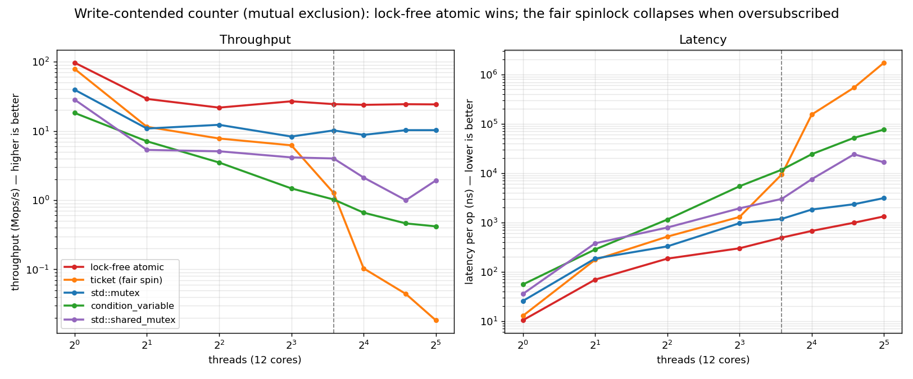
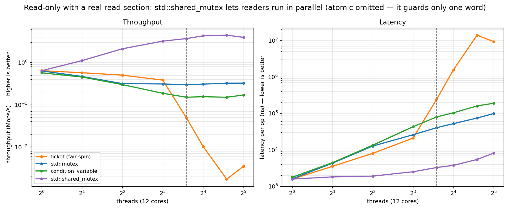

# sync-shootout

A small **C++23 benchmark of thread synchronization primitives** — the classic
"lock shootout." It compares five ways to coordinate access to shared data and
measures the two numbers that matter under concurrency: **throughput (Mops/s)**
and **per-operation latency (ns)**, as the thread count crosses the core count.

It's not about one winner — it's about *which primitive fits which workload*.

## The five primitives

### 1. `condition_variable` — a blocking lock you build yourself
```cpp
void lock() {
    std::unique_lock<std::mutex> lk(m);
    cv.wait(lk, [&]{ return !held; });   // sleep until the lock is free
    held = true;
}
void unlock() {
    { std::lock_guard<std::mutex> lk(m); held = false; }
    cv.notify_one();                      // wake one waiter
}
```
A condition variable lets a thread **sleep until notified**. Here it's wired into
a hand-rolled mutex — the textbook use. The benchmark shows you usually shouldn't:
`std::mutex` does the same job with less overhead.

### 2. `std::mutex` — the standard blocking lock
```cpp
void lock()   { m.lock(); }    // spins briefly, then parks on a futex
void unlock() { m.unlock(); }
```
The default, and almost always the right default: cheap when uncontended, and it
**parks** waiters (zero CPU) when contended, so it survives oversubscription.

### 3. `std::shared_mutex` — a reader-writer lock
```cpp
void lock_shared()   { m.lock_shared(); }   // many readers at once
void unlock_shared() { m.unlock_shared(); }
void lock()          { m.lock(); }          // or one exclusive writer
```
Lets **many readers run in parallel**, or one writer alone. Wins big when reads
dominate and each read does real work — but it's heavier than a plain mutex, so
it loses if writes are frequent or critical sections are tiny.

### 4. `ticket` lock — a fair spinlock
```cpp
void lock() {
    uint32_t my = next.fetch_add(1);                 // take a number
    while (serving.load(acquire) != my) cpu_relax();  // busy-wait your turn
}
void unlock() { serving.store(serving.load() + 1, release); }  // serve the next
```
Strict **FIFO** — nobody starves. Great when threads fit on cores; but it *spins*
(burns CPU) and **convoy-collapses when oversubscribed**: if the next ticket
holder is descheduled, everyone behind it waits.

### 5. lock-free `atomic` — no lock at all
```cpp
void write() { counter.fetch_add(1, relaxed); }     // atomic read-modify-write
auto read()  { return counter.load(relaxed); }
```
The fastest option and never blocks — but it only works for a **single word**.
Anything bigger than one atomic variable still needs a lock.

## Benchmark 1 — write-contended counter (mutual exclusion)

Every thread increments a shared counter (`read = 0`, no critical-section work),
so this measures pure lock cost as contention rises.



Throughput (Mops/s, higher better) and latency at 8 threads (12-core machine):

| primitive | 1 thr | 8 thr | 32 thr | latency @8 | size |
|---|--:|--:|--:|--:|--:|
| lock-free `atomic` | 97 | **27** | **24** | **299 ns** | 8 B |
| `ticket` (fair spin) | 79 | 6.2 | 0.0 | 1290 ns | 8 B |
| `std::mutex` | 39 | 8.3 | 10.3 | 964 ns | 40 B |
| `std::shared_mutex` | 28 | 4.1 | 1.9 | 1929 ns | 56 B |
| `condition_variable` | 18 | 1.5 | 0.4 | 5412 ns | 96 B |

**Lock-free `atomic` wins throughput at every level.** Among the locks,
`std::mutex` is best and the only one that stays steady when oversubscribed; the
`ticket` spinlock is quick at 1 thread but **collapses past 12 cores** (FIFO
convoy); the hand-rolled `condition_variable` lock is slowest — use `std::mutex`.

## Benchmark 2 — read-only (reader-writer)

100% reads, each holding the lock for a real (non-trivial) read section — the
workload `std::shared_mutex` is built for. (Lock-free `atomic` is omitted: it can
only guard one word, not a multi-step read.)



Throughput (Mops/s, higher better):

| primitive | 1 thr | 8 thr | 24 thr |
|---|--:|--:|--:|
| `std::shared_mutex` | 0.64 | **3.2** | **4.4** |
| `std::mutex` | 0.63 | 0.31 | 0.32 |
| `condition_variable` | 0.57 | 0.19 | 0.15 |
| `ticket` (fair spin) | 0.64 | 0.38 | 0.00 |

**`std::shared_mutex` is the only one that scales** — readers run concurrently
(~10× a plain mutex at 8 threads, and still climbing at 24). The exclusive locks
serialize every read, so they stay flat; `ticket` additionally convoy-collapses.

> Note: glibc's `shared_mutex` is *writer-preferring*, so the win is fragile —
> even a few percent writes let pending writers block the reader pool and
> serialize it back down to (or below) a plain mutex.

## Quick start

```bash
cmake --preset default && cmake --build build    # fetches Catch2 on first run
ctest --test-dir build                           # every lock must actually exclude

./scripts/sweep.sh           # run the grid -> results/sweep.csv
python3 scripts/plot.py      # render the charts -> docs/img/

# one data point:
./build/shootout --primitive ticket       --threads 8 --read 0  --cs 0
./build/shootout --primitive shared_mutex --threads 8 --read 95 --cs 1000
```

## How it works

| piece | where |
|---|---|
| The five primitives, behind a `Lock` concept | `include/shootout/Primitives.hpp` |
| The benchmark (one scenario, a `read` knob) | `include/shootout/Scenarios.hpp` |
| Timing/throughput metrics | `include/shootout/Metrics.hpp` |
| One `-O3 -march=native` driver, dispatch by name | `src/shootout.cpp` |
| Catch2 mutual-exclusion tests | `src/tests.cpp` |

## Requirements & caveats

- CMake ≥ 3.28, Ninja, a C++23 compiler (tested g++ 15.2); Python 3 + matplotlib + numpy for charts.
- One 12-core machine (WSL2). **Shapes and crossovers are portable; absolute numbers aren't** — re-run `sweep.sh` on your hardware.
- A learning/benchmarking tool, not a lock library — the primitives favor clarity.
