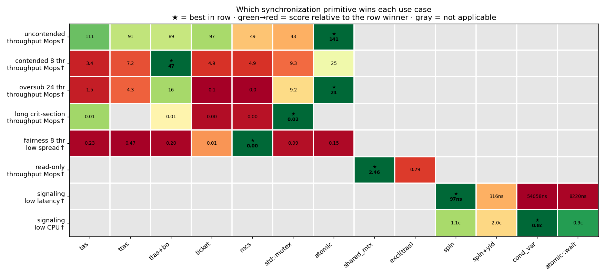
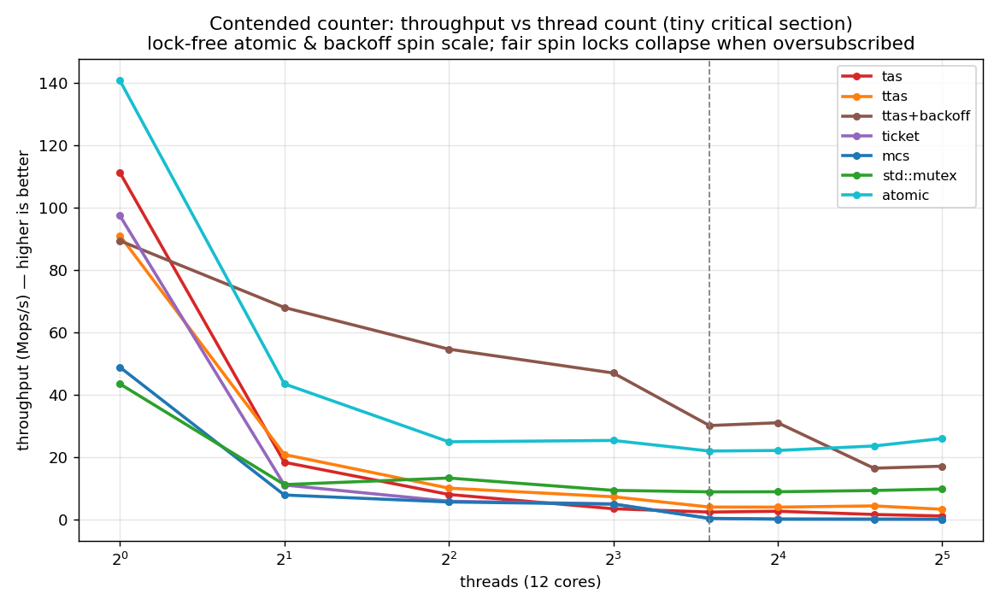
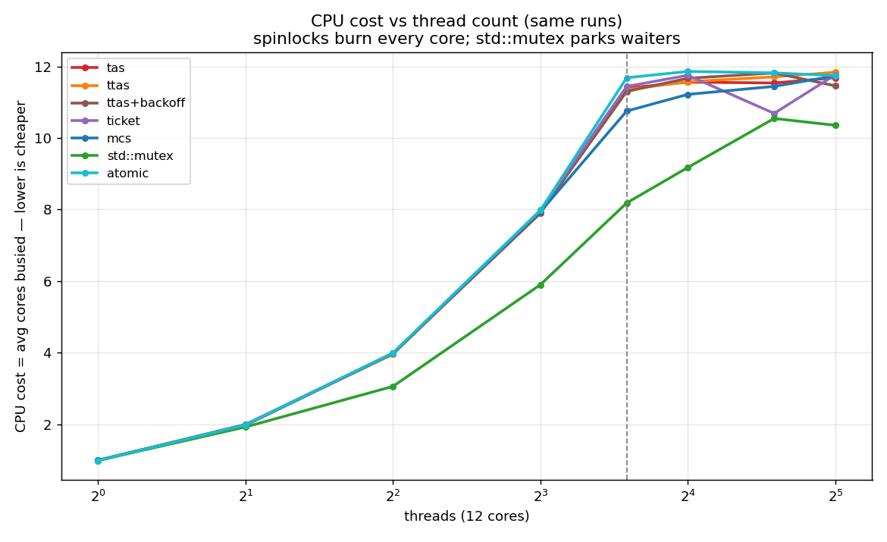
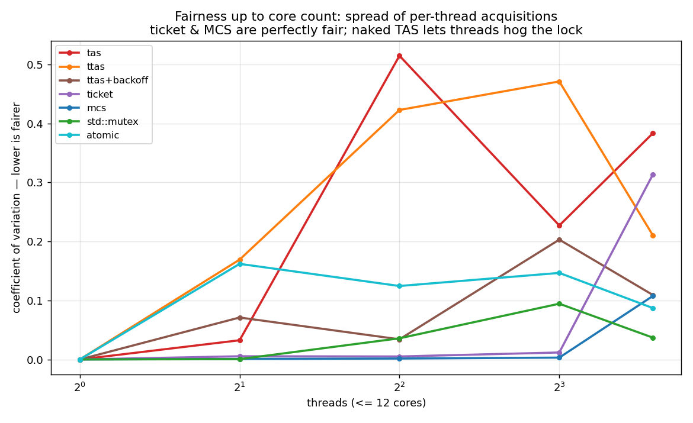
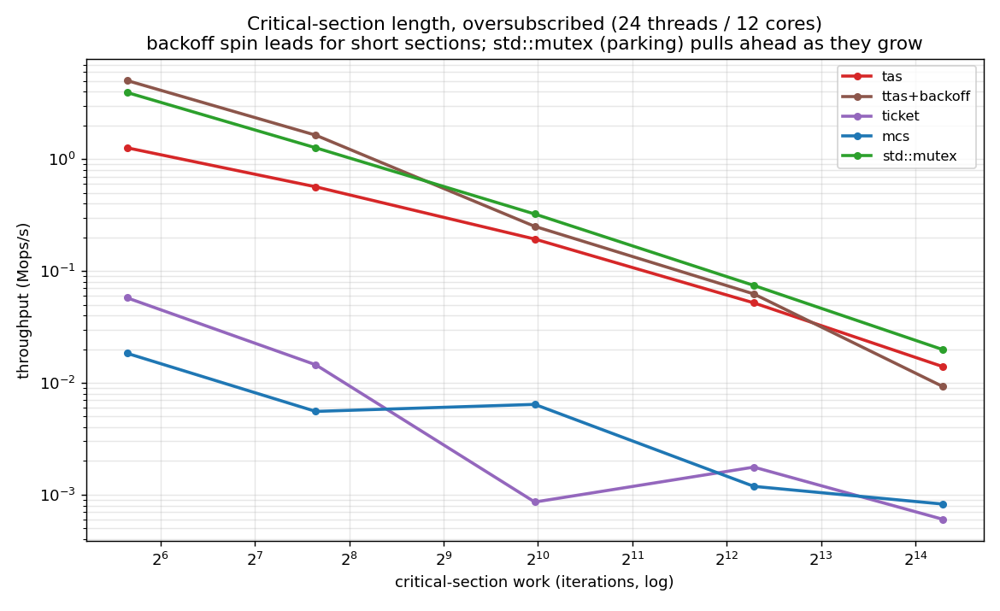
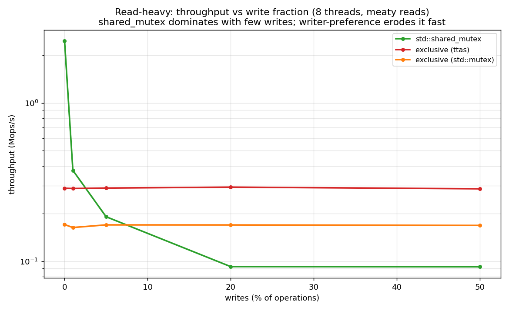
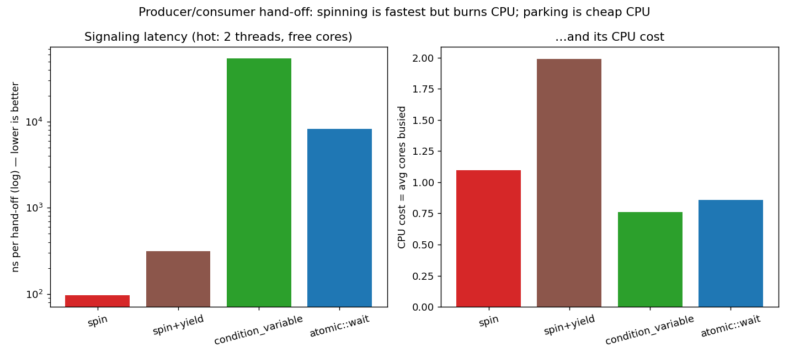

# sync-shootout

A **modern C++23 benchmark of thread synchronization primitives** — the classic
"lock shootout" / synchronization-primitive microbenchmark. It pits spinlocks,
blocking mutexes, fair locks, reader-writer locks, lock-free code, and event
signaling against each other across **multithreading scenarios chosen so each
primitive gets a use case where it wins**, and reports the costs that actually
matter under concurrency: **throughput, latency, CPU, memory, and fairness.**

It's not about crowning one winner — it's a map of *which primitive fits which
contention regime*, and what you pay for it.

## Which primitive wins each use case



*(one chart, every primitive × every use case; ★ = best in row, green→red = score
relative to the row winner, gray = not applicable. Numbers are the measured
values. 12-core machine, g++ 15.2 `-O3 -march=native`.)*

| use case | winner | numbers (this machine) | why |
|---|---|---|---|
| **uncontended** (lock rarely taken) | lock-free `atomic` | 141 vs `std::mutex` 43 Mops | fewest instructions, no syscall |
| **contended, tiny section** (≤ cores) | `ttas+backoff` | 47 vs lock-free 25 Mops | dodges the cache-line storm; even beats a shared atomic |
| **oversubscribed** (threads ≫ cores) | lock-free `atomic` (`std::mutex` best *lock*) | 24 / 9.2 Mops | **fair spin locks collapse** — ticket 0.1, mcs 0.0 |
| **long critical section** (oversub) | `std::mutex` | leads as the section grows | parking; a spinner just steals the holder's core |
| **fairness** (≤ cores) | `mcs` / `ticket` | cov 0.00–0.01 vs `tas` 0.2–0.5 | strict FIFO — nobody starves |
| **read-only / read-mostly** | `std::shared_mutex` | 2.46 vs exclusive 0.29 Mops | readers run in parallel — *but only while writes are rare* |
| **signaling latency** (core to spare) | `spin` | 97 ns vs `condition_variable` 54,000 ns | wakes at cache-coherence speed |
| **signaling CPU thrift** | `condition_variable` | 0.8 vs `spin` 1.1 cores | a parked waiter costs ~0 CPU |

**Five things the data shows:**
1. `tas` (naked test-and-set) is never the right answer — `ttas+backoff` beats it everywhere.
2. **Fair spin locks (ticket/MCS) convoy-collapse when oversubscribed** — fine ≤ cores, catastrophic past it.
3. A **backoff spinlock can beat a lock-free atomic counter** at moderate contention (a shared `fetch_add` ping-pongs one cache line every op).
4. `std::shared_mutex` only pays off when writes are genuinely rare — glibc is writer-preferring, so a few percent writes erase the win.
5. Spinning buys signaling latency by **spending CPU**; parking is the opposite trade. Always look at the CPU axis, not just latency.

## The details, per scenario

| | |
|---|---|
|  |  |
| **Throughput vs threads** — lock-free & backoff scale; fair locks collapse past 12 cores. | **CPU cost vs threads** — spin locks burn every core; `std::mutex` parks. |
|  |  |
| **Fairness** — ticket/MCS are even; TAS lets a thread hog the lock. | **Critical-section length (oversubscribed)** — spin for short, `std::mutex` for long. |
|  |  |
| **Read-heavy** — `shared_mutex` dominates at 0% writes, erodes fast. | **Signaling** — spin is fastest but burns CPU; parking is cheap CPU. |

Full discussion: **[docs/findings.md](docs/findings.md)**.

## Primitives

| family | primitives |
|---|---|
| **busy-wait** | `tas`, `ttas`, `ttas_backoff` (exponential backoff) |
| **fair spin** | `ticket` (FIFO), `mcs` (queue lock, per-waiter cache line) |
| **blocking** | `std::mutex` (futex park) |
| **lock-free** | `atomic` counter (`fetch_add`) |
| **reader-writer** | `std::shared_mutex` vs an exclusive-lock baseline |
| **signaling** | `spin`, `spin+yield`, `condition_variable`, `std::atomic::wait` |

## Quick start

```bash
cmake --preset default && cmake --build build   # fetches Catch2 on first run
ctest --test-dir build                          # every lock must actually exclude

./scripts/sweep.sh        # run the grid -> results/sweep.csv
python3 scripts/plot.py   # render the charts -> docs/img/

# single data point:
./build/shootout --scenario contended --primitive ttas_backoff --threads 16 --cs 0
./build/shootout --scenario readheavy  --primitive shared_mutex --threads 8 --write 0 --cs 2000
./build/shootout --scenario signaling  --primitive cv --threads 1 --rounds 30000
```

## How it works

| piece | where |
|---|---|
| Primitives behind `concept`s (`Mutex` / `SharedMutex` / `Gate`) | `include/shootout/{Mutexes,RWLocks,Gates}.hpp` |
| Time-bounded scenarios returning a `Result` | `include/shootout/Scenarios.hpp` |
| Cost metrics — CPU via `getrusage`, fairness, medians | `include/shootout/Metrics.hpp` |
| One `-O3 -march=native` driver, runtime dispatch by name | `src/shootout.cpp` |
| Catch2 mutual-exclusion tests | `src/tests.cpp` |

Adding a primitive = one struct satisfying the relevant concept + one line in the
dispatch table.

## Requirements & caveats

- CMake ≥ 3.28, Ninja, a C++23 compiler (tested g++ 15.2); Python 3 + matplotlib + numpy for charts.
- One 12-core box (WSL2). **Shapes and crossovers are portable; absolute numbers aren't** — re-run `sweep.sh` on your hardware.
- `getrusage` CPU resolution is coarse, so runs are sized to ≥ ~100 ms.
- A learning/benchmarking tool, not a lock library — primitives favor clarity.
