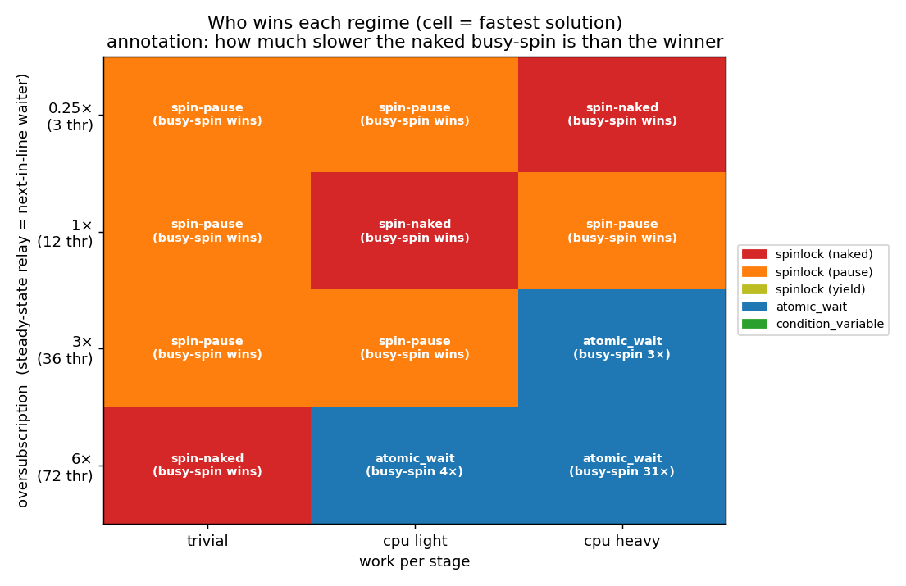

# leetcode-compare

A small **modern C++23** benchmarking harness for **comparing different solutions
to the same LeetCode problem** — not just "is it accepted?", but *why is one
solution faster than another?*

Each problem ships with multiple solutions, a set of test cases, and a test
engine that compiles every solution **optimized and in isolation**, runs it, and
reports **wall time, peak memory, and object size**. Timing is cross-checked
with [Catch2](https://github.com/catchorg/Catch2)'s statistical
micro-benchmarking.

## Architecture

| piece | what it is | where |
|---|---|---|
| **Solution** | one answer to a problem (a self-contained header) | `problems/<p>/solutions/*.hpp` |
| **Test case** | a workload *shape* — concurrency, ordering, repetitions, and the **payload** each action runs — independent of any solution | `problems/<p>/testcases/*.hpp` |
| **Work** | the payload: `none` / `cpu` (compute) / `sleep` (I/O stand-in), so the comparison reflects real work, not just a print | `engine/Work.hpp` |
| **Test engine** | drives any solution (constrained by a `concept`) through any test case, verifies correctness, measures the three costs — **latency, CPU (avg cores busied via `getrusage`), and memory** | `engine/Engine.hpp` |

A solution and a test case are combined by the engine in three front-ends:

- **`test/`** — Catch2 correctness tests (every solution must pass before it's timed).
- **`bench/`** — Catch2 statistical benchmark (rigorous mean / std-dev / outliers).
- **`runner/`** — a generic `main` compiled **once per solution** into its own
  `-O3 -march=native` binary, run as a separate process so peak-RSS is meaningful
  and solutions can't contaminate each other. `scripts/compare.sh` builds them
  all and prints a sorted comparison table.

### Modern stack

C++23 throughout: `std::jthread` (RAII join), `std::latch` (simultaneous start),
a `concept` constraining solutions, `std::ranges` pipelines, `std::atomic::wait`,
`std::print`/`std::format`. Modern CMake (≥ 3.28) with `CMakePresets.json`, Ninja,
and `FetchContent` (`SYSTEM` + `EXCLUDE_FROM_ALL` + `FIND_PACKAGE_ARGS`).

## Problems

| problem | comparison | headline result |
|---|---|---|
| [Print in Order](problems/print-in-order/) (LC 1114) | condition variable vs spinlock, plus `atomic_wait` / pause / yield variants | the spinlock is **~350× faster** for a hot, non-oversubscribed handoff but up to **~35× slower** once oversubscribed *with work to do*; `atomic_wait` is the robust modern middle |

## Learning: where each primitive wins

The repo isn't just a leaderboard — it sweeps the parameter space and graphs the
crossover. Full write-up: **[docs/print-in-order-deep-dive.md](docs/print-in-order-deep-dive.md)**.
The two knobs that decide the winner are **oversubscription** (threads / cores)
and **work per thread**:



```bash
./scripts/sweep.sh        # parameter grid for all solutions -> results/sweep.csv
python3 scripts/plot.py   # renders the graphs into docs/img/
```

## Quick start

```bash
# configure + build everything (fetches Catch2 on first run)
cmake --preset default
cmake --build build

# 1. correctness (must pass before benchmarking means anything)
ctest --preset default

# 2. head-to-head: each solution built optimized, run in isolation
./scripts/compare.sh            # trivial action
./scripts/compare.sh cpu        # each action does CPU work
./scripts/compare.sh sleep      # each action does blocking-I/O-like sleep

# 3. rigorous statistical timing
./build/problems/print-in-order/bench_print_in_order
```

Example `compare.sh cpu` output (12-core WSL2, g++ 15.2):

```
testcase        solution            sizeof(B)  median(ms)  min(ms)   max(ms)   peakRSS(KiB)
contention/cpu  atomic_wait         4          144.209     141.581   153.339   4716
contention/cpu  condition_variable  96         144.609     142.620   146.882   4660
contention/cpu  spinlock_yield      4          157.238     150.718   173.777   4820
contention/cpu  spinlock_pause      4          1207.468    783.805   1469.630  4864
contention/cpu  spinlock            4          1289.680    1089.419  1476.147  4612
```

See [`problems/print-in-order/README.md`](problems/print-in-order/) for the full
write-up of *why* the spinlock is slower.

## Requirements

- CMake ≥ 3.28, Ninja, a C++23 compiler (tested with g++ 15.2)
- Internet on first configure (Catch2 is fetched via `FetchContent`)
- For the graphs: Python 3 with `matplotlib` + `numpy` (no pandas needed)

## Adding a problem

1. `problems/<name>/solutions/*.hpp` — each solution as a header (same public API,
   satisfying `engine::PrintInOrder` or your problem's concept).
2. `problems/<name>/testcases/*.hpp` — workload shapes built on `engine::TestCase`.
3. Wire `test/`, `bench/` and the `runner/` targets in a `CMakeLists.txt`
   (copy `print-in-order`'s).
