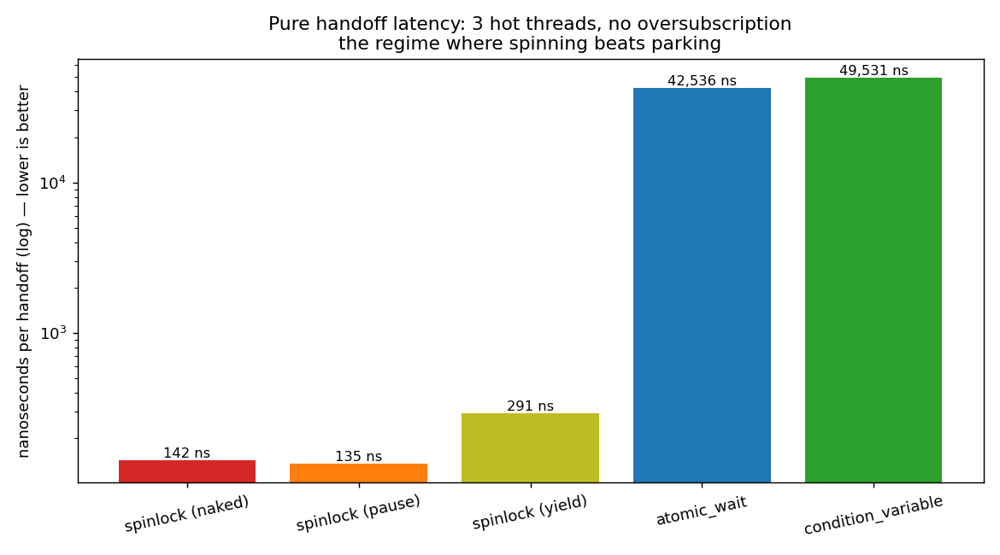
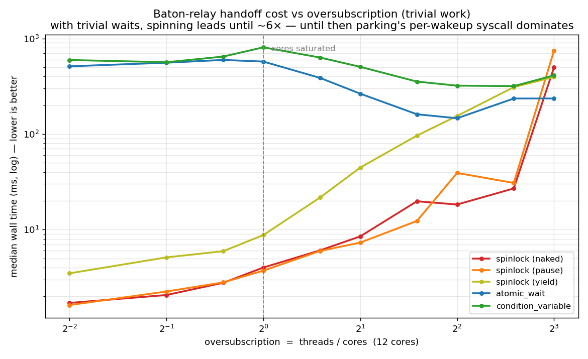
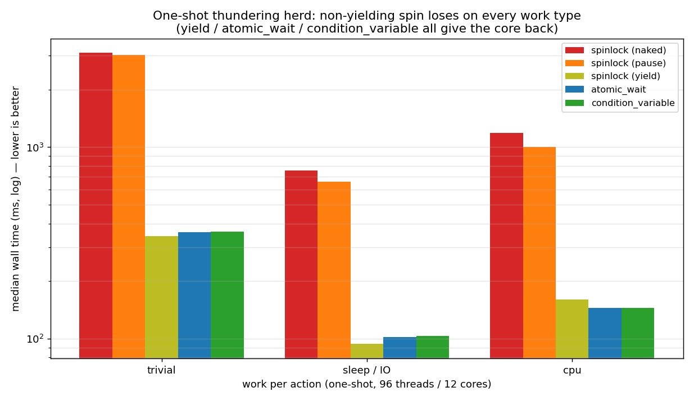

# Deep dive: when does a spinlock beat a condition variable?

LeetCode [1114 "Print in Order"](https://leetcode.com/problems/print-in-order/)
asks you to make three threads run in order. The interesting part isn't getting
it accepted — both a spinlock and a condition variable pass. The interesting
part is that **the same problem has opposite "best" answers depending on the
runtime conditions**, and this page measures exactly where the line is.

All numbers below are produced by this repo on a 12-core machine (WSL2, g++ 15.2,
`-O3 -march=native`). Reproduce with:

```bash
./scripts/sweep.sh        # runs the parameter grid -> results/sweep.csv
python3 scripts/plot.py   # renders the graphs in docs/img/
```

The five solutions compared (see [`../problems/print-in-order/solutions`](../problems/print-in-order/solutions)):

| | how it waits | object |
|---|---|---|
| `spinlock` (naked) | busy-loop on an atomic | 4 B |
| `spinlock` (pause) | busy-loop + `PAUSE` hint | 4 B |
| `spinlock` (yield) | busy-loop + `yield()` (gives the core back) | 4 B |
| `atomic_wait` | lock-free fast path, **parks** on `atomic::wait` | 4 B |
| `condition_variable` | mutex + cv, **parks** on a futex | 96 B |

There are **two independent knobs** that decide the winner: how many threads
share the cores (**oversubscription**), and how long each thread holds the baton
(**work**). The four graphs below take them one at a time, then together.

---

## 1. Pure handoff latency — spinlock wins ~350×

Three long-lived threads pass a baton back and forth as fast as they can, on a
machine with spare cores (no oversubscription). Nothing blocks for long, so the
**cost of a single handoff** is all that's measured.



A spinlock notices a released baton at cache-coherence speed — **~140 ns**. A
parking primitive (condition variable / `atomic_wait`) must make a futex syscall
and take a context switch on *every* wakeup — **~50,000 ns** here. That's a
**~350× gap**. This is why low-latency code — SPSC queues between pinned threads,
kernel spinlocks, audio/HFT hot paths — spins on purpose. (`yield` sits in the
middle at ~290 ns: it spins but pokes the scheduler each iteration.)

---

## 2. Increasing oversubscription, trivial work — the spinlock is *robust*

Hold the work trivial and add relay lanes until threads outnumber cores. You
might expect the spinlock to fall apart the moment it crosses 1×. It doesn't:



The spinning variants (warm colours) stay **far below** the parking ones (blue/
green) until roughly **6×** oversubscription. Why? With trivial waits there's no
real work for a spinner to steal a core *from*; meanwhile parking pays its fixed
~50 µs syscall on every single handoff. The spinner wastes cycles, but wasted
cycles are cheaper than syscalls here — right up until ~6×, where the naked/pause
spinners finally spike and lose. **Takeaway: oversubscription alone is not enough
to sink a spinlock.** You need the other knob too.

---

## 3. Both knobs together — the real crossover

Now vary oversubscription **and** work, and colour each cell by its fastest
solution (annotation = how many times slower the naked spinlock is than the
winner):


- **Top half (threads fit on cores):** a spin variant wins everywhere, even with
  heavy CPU work.
- **Bottom-right (oversubscribed *and* real work):** parking wins decisively —
  the naked spinlock is **8× slower** than `condition_variable` on cpu-light and
  **35× slower** than `atomic_wait` on cpu-heavy. A spinning waiter is now burning
  a core running its busy-loop while the thread that owns the baton has real work
  to do and can't get scheduled.
- `atomic_wait` is the most robust square on the map: spinlock-tiny object,
  lock-free fast path, but it sleeps instead of starving the worker.

The crossover isn't a line at 1× — it's a corner. You need **enough threads to
contend for cores AND enough work that losing a core actually hurts.**

---

## 4. Work *type* under a thundering herd — the harshest case for spinning

One-shot mode releases 96 threads (8× the cores) simultaneously off a latch — a
thundering herd where everyone contends at once. Vary what each action does:



The non-yielding spinners (naked/pause) tower over everyone on all three work
types — ~8–9× slower. Worst relative case is what you'd expect:

- **sleep / IO:** while the baton-holder is parked in a syscall (off-CPU), a
  spinner burns a whole core for the *entire* sleep doing nothing.
- **cpu:** the spinner steals the core the worker needs.
- **trivial:** even here the simultaneous cache-line storm + thread churn sinks it.

Note `yield` is technically a busy-wait too, yet it keeps up with the parking
solutions — because it hands the core back. The lesson is precise: it's
**non-yielding** spinning under contention that loses, not lock-free code.

---

## The variables, summarised

| variable | favours spinning | favours parking |
|---|---|---|
| **oversubscription** (threads / cores) | ≤ ~6× *if work is trivial*; ≤ 1× once work is real | high + real work |
| **work / wait duration** | very short (< a syscall, ~1–5 µs) | long |
| **work type** while holding the baton | — | blocking I/O (holder off-CPU) |
| **contention pattern** | steady state, few active at once | thundering herd |
| **thread affinity** | pinned, hot threads | threads migrate / share cores |
| **object count / cache** | millions of locks → 4 B atomic wins on footprint | — |
| **wakeup-latency requirement** | need deterministic ns wakeup | µs jitter acceptable |

## Rules of thumb

- **Spinlock** when waits are sub-microsecond *and* you control scheduling
  (pinned threads, no oversubscription). In that niche it's ~350× faster.
  Outside it — oversubscribed and doing real work — it's up to ~35× slower.
- **Condition variable** when waits can be long, threads outnumber cores, or you
  just want the safe default. Costs a bigger object (96 B) and a slow-path syscall.
- **`std::atomic::wait`** is the modern sweet spot for simple counters/flags:
  4-byte lock-free object, lock-free fast path, parks when it must. The most
  robust performer across the whole map. If you were reaching for a spinlock
  "for speed," reach for this instead unless you've measured the spin genuinely
  wins your case.

**The headline:** the original spinlock wasn't slow because spinlocks are slow —
it was slow because it was measured oversubscribed *with work to do*. Flip either
condition and it wins enormously. `atomic_wait` keeps everything good about the
spinlock (tiny, lock-free) while removing the one thing that bit it
(busy-waiting), so it's the safest default if you don't fully control the
runtime.
